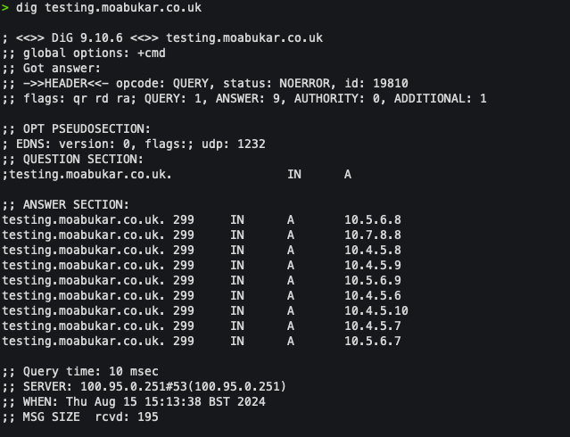
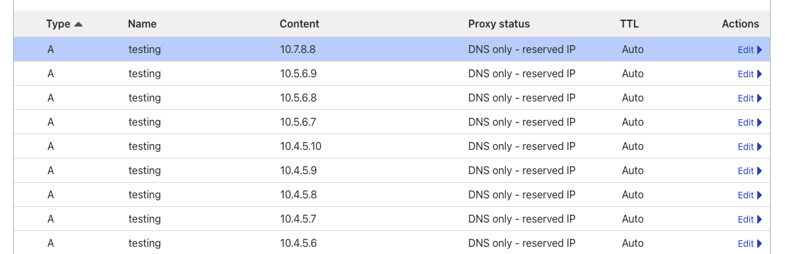

# Adv net topics

### UDP restriction of DNS

Context: When you `dig` a service/DNS, you receive only 8 records and no more than that. DNS works with UDP, if the record is bigger than a single UDP frame (512 bytes) then it can only be served over TCP. This is a limiation within DNS itself when dealing with TCP.

## What does this mean?

Some problems it could lead to: This means if we have more than 8+ instances running, we will not be able to hit all the rest of the IPs. This means any IPs which are more than the threshold of 8 goes to waste as a result wasting resources.


## Examples

In the example, I have around 10 records on my Cloudflare but I only receive 8 records back from dig due to DNS UDP limitation. 

Screenshots shown here:






## How QUIC protocol is better on TLS with TLS over TCP.

Basics: QUIC (Quick UDP Internet Connections) is a protocol developed by Google and now standardized by the IETF as HTTP/3. It combines features of TCP, TLS, and HTTP/2, operating over UDP instead of TCP

```bash
### Connection Establishment Time (Latency)

- TLS over TCP: Establishing a secure connection with TLS over TCP typically requires multiple round-trip times (RTTs):
    - The TCP handshake requires an RTT.
    - The TLS handshake requires additional RTTs (1-2, depending on the version and setup).
    - Only after these handshakes is the data sent.

- QUIC: QUIC significantly reduces the latency by combining the connection establishment and encryption setup:
    - QUIC’s handshake combines the initial connection setup and the TLS handshake into a single step, allowing data to be sent with the first packet.
    - In many cases, QUIC can establish a secure connection in a single RTT or even zero RTT (if resuming a session).

### Reduced Head-of-Line Blocking

- TLS over TCP: TCP is a reliable protocol that ensures data is received in order. However, this creates "head-of-line blocking," where a lost packet blocks the delivery of all subsequent packets until the lost one is retransmitted and received.
    - Even when encrypted with TLS, TCP's head-of-line blocking can cause delays, especially on lossy networks.
- QUIC: QUIC, being built on top of UDP, avoids head-of-line blocking:
    - QUIC supports multiplexing multiple streams over a single connection, and each stream can be delivered independently.
    - If a packet is lost, only the stream associated with that packet is delayed, not the entire connection.

### Integrated security

- TLS over TCP: Security is layered on top of TCP. After establishing a TCP connection, TLS is layered on top to provide encryption and secure communication. This layered approach introduces complexity and additional overhead.
- QUIC: Security is integrated directly into the protocol:
    - QUIC combines the functionality of TLS directly within its protocol, meaning the connection setup and security establishment are streamlined.
    - This integration allows for faster and more efficient connection establishment, as well as simpler protocol design.

### Better Performance on Mobile Networks

- TLS over TCP: When a device moves between networks (like from Wi-Fi to cellular), the TCP connection typically needs to be re-established because the IP address changes. This means the TLS handshake must also be restarted, leading to additional latency.
- QUIC: QUIC is designed to handle network changes more gracefully:
    - QUIC connections are identified by a unique connection ID, which remains constant even if the underlying IP address changes.
    - This allows a QUIC connection to survive network changes without requiring a new handshake, reducing latency and improving user experience.

### Improved Congestion Control

- TLS over TCP: TCP’s congestion control mechanisms are well-established but have limitations, especially on networks with high packet loss or varying latency. These mechanisms are also not easily extensible.
- QUIC: QUIC implements its own congestion control, allowing for more advanced and customizable algorithms:
    - Since QUIC is a user-space protocol (implemented in application space rather than the kernel), it can be updated more frequently and flexibly than TCP.
    - This allows QUIC to adapt more quickly to changing network conditions, leading to better performance in various network environments.

### Stream Multiplexing without Head-of-Line Blocking

- TLS over TCP: HTTP/2 introduced stream multiplexing over a single TCP connection, but due to TCP's head-of-line blocking, the entire connection can be stalled if one stream encounters packet loss.
- QUIC: QUIC natively supports stream multiplexing without head-of-line blocking:
    - Each stream is independent, meaning a lost packet affects only that particular stream, not others. This results in more efficient data transmission, particularly for applications that rely on multiple simultaneous streams (like websites loading multiple resources).

### Reduced Overhead and Simplicity

TLS over TCP: The traditional approach involves two layers (TCP and TLS), each with its own headers, handshakes, and state management, which can introduce overhead and complexity.
QUIC: QUIC simplifies the protocol stack:
By combining the functionalities of TCP and TLS into a single protocol over UDP, QUIC reduces the overall overhead.
This simplification can lead to more efficient resource usage, both in terms of CPU and network bandwidth.

### Summary

- QUIC is designed to overcome the limitations of TCP+TLS by reducing latency, avoiding head-of-line blocking, allowing connections to survive network changes, and improving performance on modern networks.
- TLS over TCP remains reliable but comes with the baggage of additional round-trip times for connection setup, head-of-line blocking, and difficulty handling network transitions smoothly.
```

### Why TCP congestion control is problem and how we can remove that

- TCP congestion control has been crucial in maintaining internet stability, but it faces challenges in modern, diverse network environments. By using alternatives like QUIC, advanced congestion control algorithms, multipath networking, and hybrid strategies, we can mitigate or even remove some of these limitations, leading to better performance, especially in high-speed, high-latency, or mobile networks.

### Http1.2 vs 1.3. Carrying Http over UDP?

Why HTTP/3 (over UDP) is an Improvement

- Reduced Latency: The primary advantage of HTTP/3 is its significantly reduced latency, achieved by eliminating multiple round trips needed for connection establishment and avoiding head-of-line blocking.
- Better Performance in Real-World Conditions: HTTP/3 is particularly advantageous in real-world conditions like lossy networks, mobile networks, and networks with fluctuating latency.
- Future-Proofing: As the web evolves, the ability of HTTP/3 to adapt more quickly and efficiently to diverse network environments makes it more future-proof compared to its predecessors.
