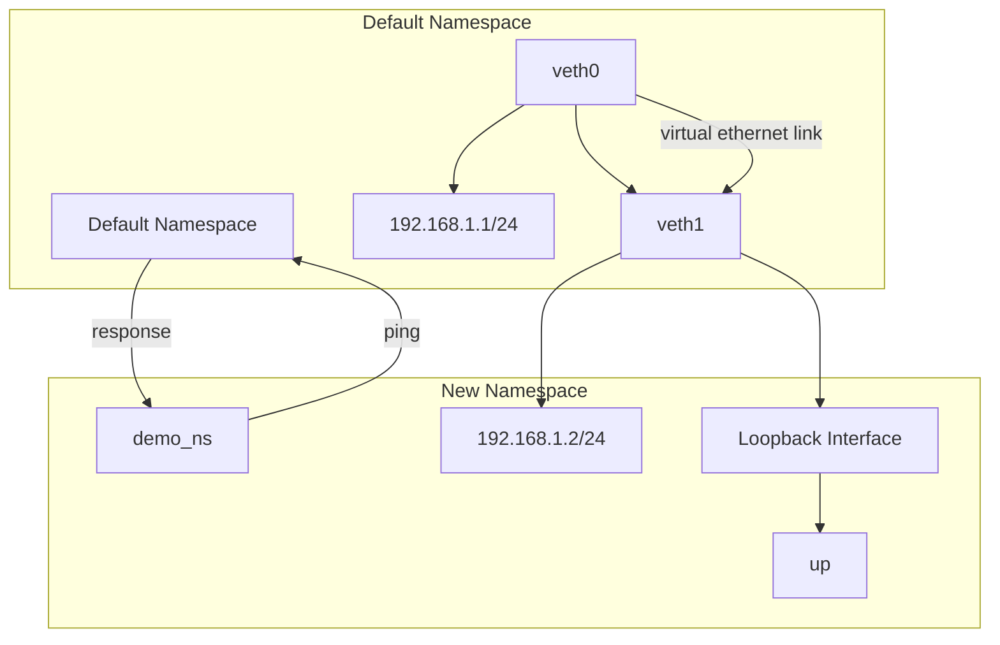
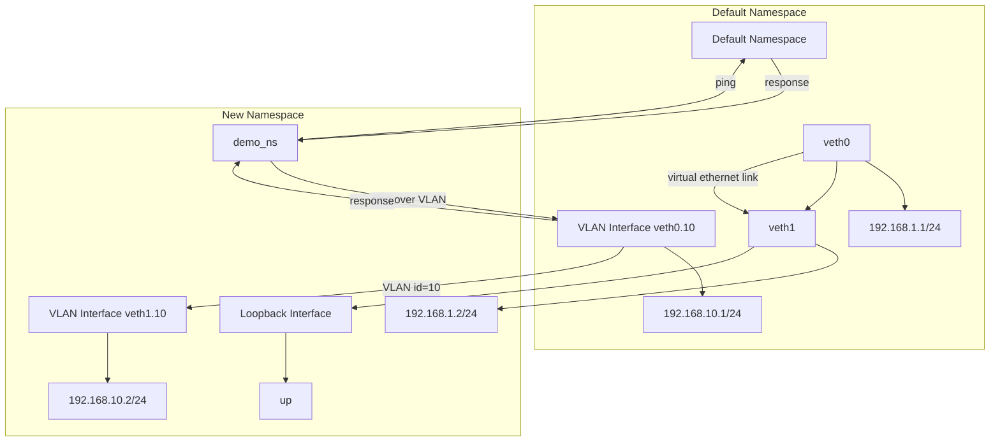

# UNIX networking


- Note: Use dockerfile in root for testing the below

```bash
cd docker
docker build -t container-unix .
docker run -it --privileged --name container-unix container-unix /bin/sh
```

## Custom network namespace in UNIX



```bash
# Create a new network namespace using ip netns.
ip netns add demo_ns

# Create a pair of virtual Ethernet devices. Linked together, so sending data out one side will arrive on the other side. (like a virtual cable)
ip link add veth0 type veth peer name veth1

# Moves the veth1 interface into the demo_ns namespace. Now veth1 is only visible/usable inside that namespace.
ip link set veth1 netns demo_ns

# Set up the interfaces in both the default namespace and the new namespace. Assigns the IP address 192.168.1.1 (with mask /24) to veth0 in the default namespace. This effectively configures one end of our “virtual cable.
ip addr add 192.168.1.1/24 dev veth0


ip link set veth0 up ## Brings the veth0 interface up (active) in the default namespace so it can send/receive traffic.
ip netns exec demo_ns ip addr add 192.168.1.2/24 dev veth1 # Runs the command inside the demo_ns namespace to set the IP address 192.168.1.2/24 on the veth1 interface. This is the other end of that “virtual cable.”
ip netns exec demo_ns ip link set veth1 up # Brings the veth1 interface up (active) inside the demo_ns namespace.


ip netns exec demo_ns ip link set lo up # Enables the loopback (lo) interface inside the demo_ns namespace. Loopback is always good to have up because many applications assume it exists.

ip netns exec demo_ns ping 192.168.1.1 # From inside demo_ns, pings 192.168.1.1 (which is assigned to veth0 in the default namespace). This verifies that traffic can flow between the two interfaces and namespaces.

```

### Common commands

```bash
ip netns list # Lists all network namespaces currently defined.

ip netns exec demo_ns <command> # Executes a command inside the demo_ns namespace.

ip netns exec demo_ns ip addr # Lists all interfaces in the demo_ns namespace.
```

### Inspecting interfaces

```bash

ip addr show ## Lists all interfaces on the system.
ip addr show dev veth0 ## details about a particular interface. (in this case veth0)
ip link show dev veth0 ## same as above command. 

ip netns exec demo_ns ip link show dev veth1 ## details about a particular interface in the demo_ns namespace. (in this case veth1)
```

#### Testing connectivity between namespaces
```bash
ip netns exec demo_ns ping 192.168.1.1
ip netns exec demo_ns ping 192.168.1.2
```

#### Checking routes

```bash
ip route show ## Lists all routes on the system.
ip netns exec demo_ns ip route show ## Lists all routes in the demo_ns namespace.
```

#### Deleting a network namespace

```bash
ip netns delete demo_ns
```

#### Common pitfalls

- If you delete a network namespace, the interfaces inside it will be deleted.
- If you delete an interface, the IP address assigned to it will be removed.
- Forgetting ip netns exec: Commands like ip addr show will only show what’s in the default namespace unless you explicitly tell it to look inside demo_ns.
- Not assigning an IP: We tried to do a ping initially on the first ping but it gave Network unreachable. Coz the veth1 interface didn’t have an IP set yet.

## Internet access

```bash
sysctl -w net.ipv4.ip_forward=1 ## Enables IP forwarding on the system.


iptables -t nat -A POSTROUTING -s 192.168.1.0/24 -o eth0 -j MASQUERADE ## Sets up a NAT rule to forward traffic from the 192.168.1.0/24 subnet through the eth0 interface. So now packets coming from our custom subnet (192.168.1.0/24) to appear as if they’re coming from the host’s external interface (usually eth0 in Docker containers).

ip netns exec demo_ns ip route add default via 192.168.1.1 dev veth1 ## Adds a default route to the demo_ns namespace through the veth1 interface. This allows the namespace to route traffic to the outside world. Inside our namespace, there isn’t yet a route telling it that any traffic not on 192.168.1.0/24 should go via our host’s veth interface (veth1). We can add it with this command.

```

Summary of internet access:

- Enabled IP Forwarding on the Host:
    - We set net.ipv4.ip_forward to 1. This tells the kernel it's allowed to route (or forward) packets between different network interfaces. Without this, even if the namespace sends traffic out, the host wouldn’t forward it to the internet.
- Set Up NAT with iptables:
    - We added an iptables rule that masquerades (translates) the source IP of packets leaving the host's eth0 interface.
    - Why?
        - The namespace uses a private IP (192.168.1.2) that the internet doesn’t recognize. By using NAT (masquerading), outgoing packets appear to come from the host’s public IP. This way, return traffic knows where to go.
    - How?
        - We matched packets from our custom subnet (192.168.1.0/24) and told iptables to translate their source IP when they exit via eth0.
- Added a Default Route in the Namespace:
    - Inside the demo_ns namespace, we set a default route pointing to 192.168.1.1 (the IP on the host’s side of the veth pair).
    - Why?
        - The namespace didn’t know where to send packets destined for networks outside its own. With the default route, it now sends all non-local traffic to 192.168.1.1, which is connected to the host and, thanks to NAT and IP forwarding, can reach the internet.

In simple terms, we basically connected the namespace to the internet by:

- Allowing the host to route packets between its interfaces.
- Making sure the namespace’s traffic is "translated" to appear from the host’s IP.
- Telling the namespace where to send packets when it doesn't know the destination.

## VLANs



```bash

# Create & Add a VLAN interface to one of the virtual Ethernet devices.
ip link add link veth0 name veth0.10 type vlan id 10
ip addr add 192.168.10.1/24 dev veth0.10
ip link set veth0.10 up


# Set up the VLAN interface in the network namespace.
ip netns exec demo_ns ip link add link veth1 name veth1.10 type vlan id 10
ip netns exec demo_ns ip addr add 192.168.10.2/24 dev veth1.10
ip netns exec demo_ns ip link set veth1.10 up

# Verify connectivity over the VLAN.
ip netns exec demo_ns ping 192.168.10.1

```

## Network performance testing

```bash

# Run iperf in server mode in one container and client mode in another to test network performance.
iperf -s   # In server container
iperf -c <server_ip>  # In client container


# Capture Packets and analyse traffic

tcpdump -i eth0
```
